# Hosting a Static Website on Amazon S3

This project demonstrates how to host a **static website** (a personal portfolio site) on **Amazon S3** using public read access. Visitors reach the site through the S3 bucket's static website endpoint, and S3 serves the HTML, CSS, JavaScript, and image assets directly from the bucket.

🔗 **Live site:** `https://elinahkemuntoportfolio.s3.us-east-1.amazonaws.com/dist/index.html`

---

## 🏗️ Architecture

A user requests the site through a URL. The browser sends an `HTTP GET` request for `index.html`, S3 evaluates the request against the bucket's **public read policy**, and returns the static web assets (HTML, CSS, images) with an `HTTP 200 OK` response.


> **Note:** S3 Public Access Block is disabled for this bucket so that anonymous users can read the objects.

---

## 🧰 What's Used

| Service / Tool | Purpose |
| --- | --- |
| **Amazon S3** | Stores and serves the static website files |
| **S3 Bucket Policy** | Grants public read (`s3:GetObject`) access |
| **S3 ACLs** | Makes individual objects publicly readable |
| **Static Website Hosting** | Configures the index/error documents and endpoint |

---

## 📋 Step-by-Step Setup

### 1. Search for S3 in the AWS Console
Open the AWS Management Console and search for **S3**.

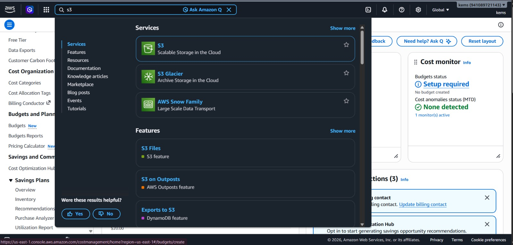

### 2. Create a Bucket
Start the bucket creation flow.

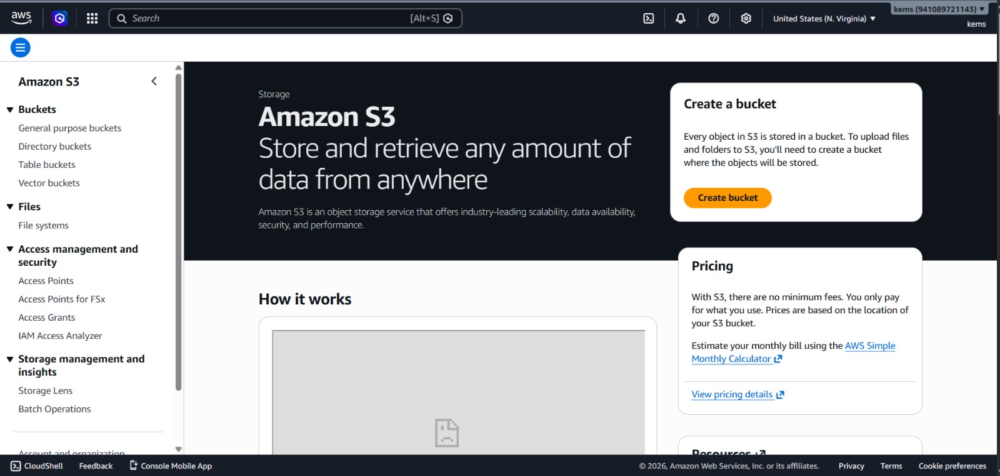
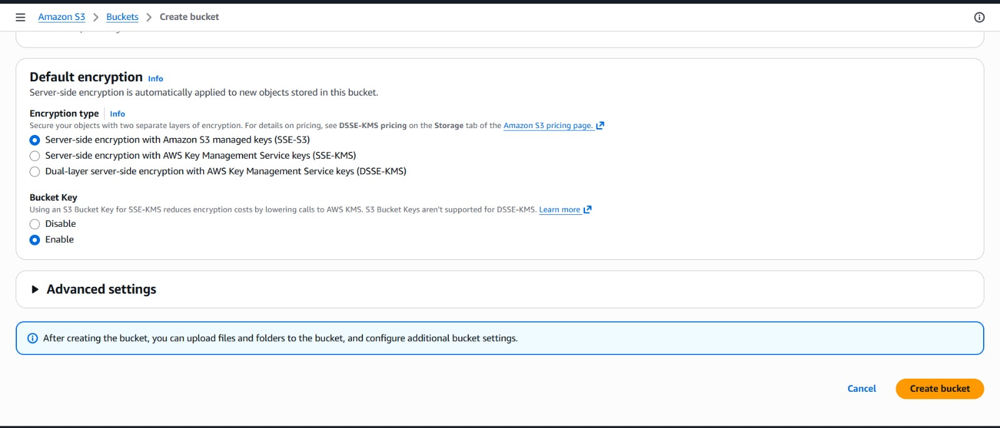

### 3. Configure Bucket Settings
Give the bucket a globally unique name and choose a region.

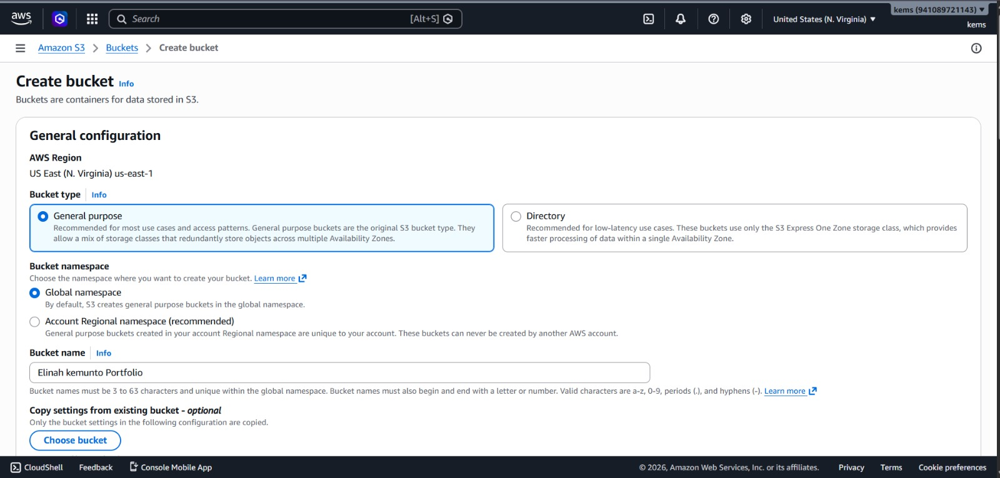

### 4. Enable ACLs
Enable Access Control Lists so objects can be made public individually.

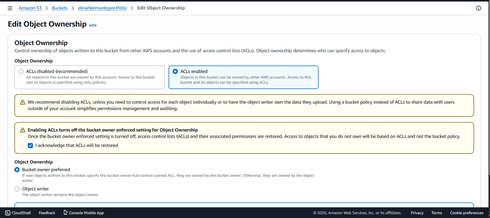

### 5. Allow Public Access
Uncheck **Block all public access** so the site can be served to anonymous users.

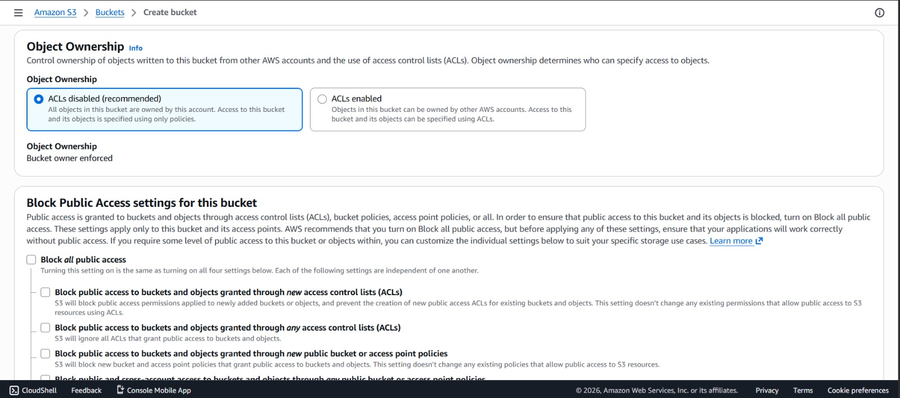

### 6. Upload the Website Files
Upload your `index.html` and all supporting assets (CSS, JS, images).

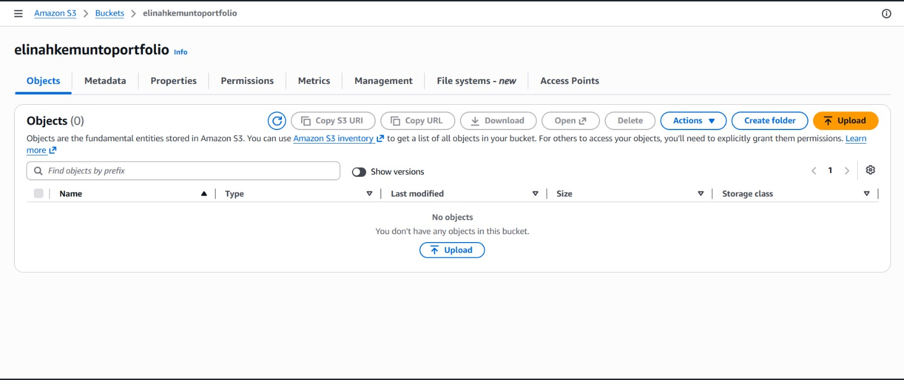
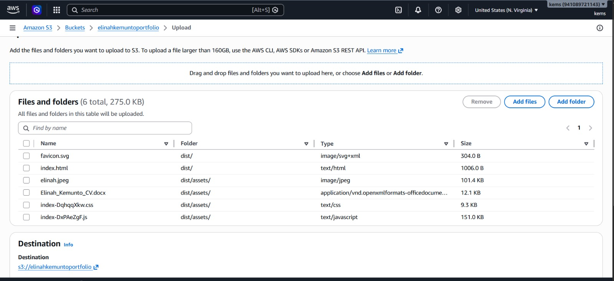

### 7. Enable Static Website Hosting
In the bucket **Properties** tab, scroll down to **Static website hosting** and enable it. Set the index document (e.g. `index.html`).

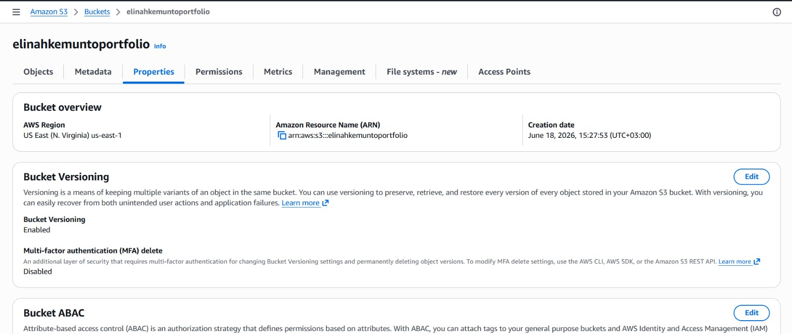
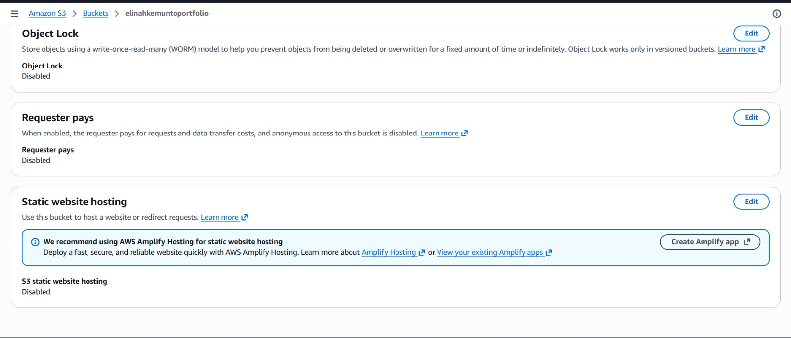

### 8. Add a Bucket Policy
Attach a bucket policy granting public `s3:GetObject` access to all objects.

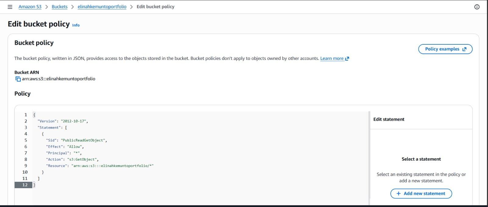

Example policy:

```json
{
  "Version": "2012-10-17",
  "Statement": [
    {
      "Sid": "PublicReadGetObject",
      "Effect": "Allow",
      "Principal": "*",
      "Action": "s3:GetObject",
      "Resource": "arn:aws:s3:::YOUR-BUCKET-NAME/*"
    }
  ]
}
```

### 9. Make Objects Public Using ACL
Select the uploaded objects and make them public via ACL.

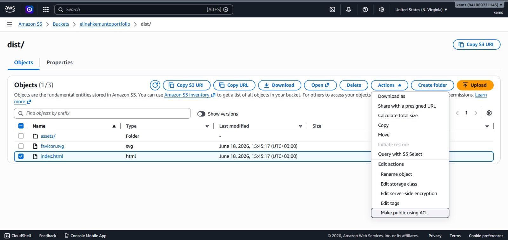

---

## ✅ Result

The static portfolio website is live and served directly from S3.

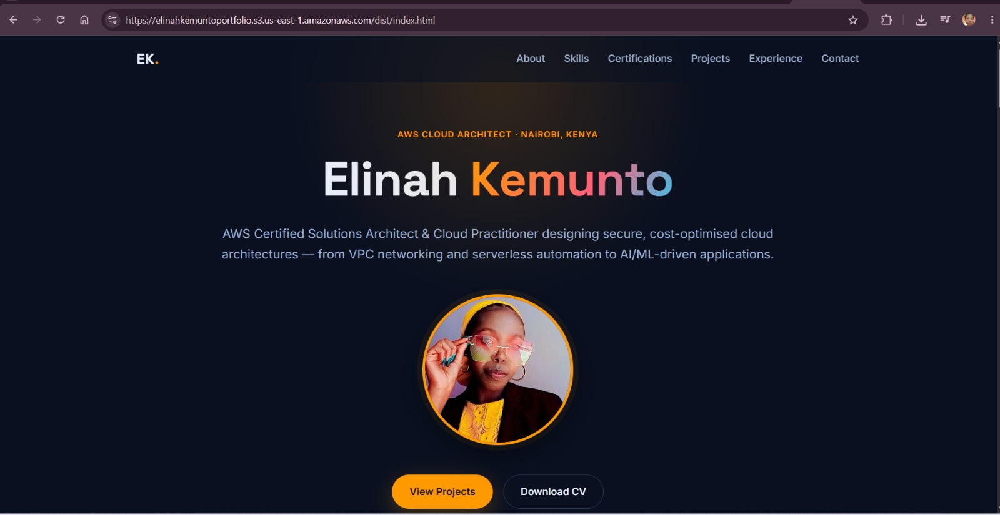

---

## 💡 Key Takeaways

- Amazon S3 can host static websites without any servers to manage.
- Public access requires **both** disabling the public access block **and** granting read access (via bucket policy and/or ACLs).
- The static website endpoint serves content over HTTP; for HTTPS and a custom domain, front the bucket with **Amazon CloudFront**.

---

## 👩🏽‍💻 Author

**Elinah Kemunto** — AWS Cloud Architect · Nairobi, Kenya
